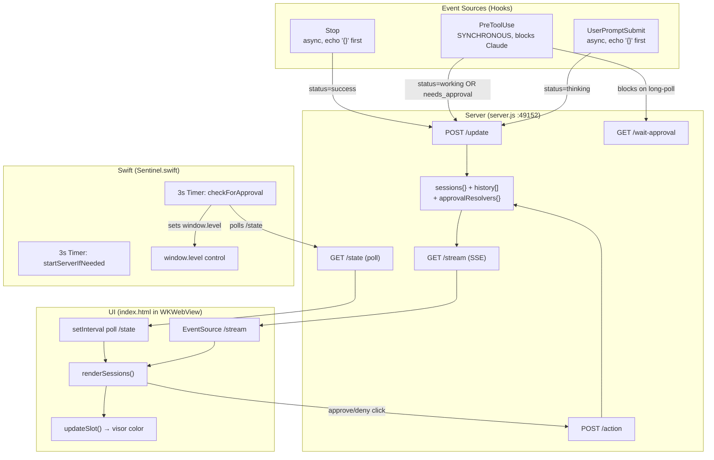
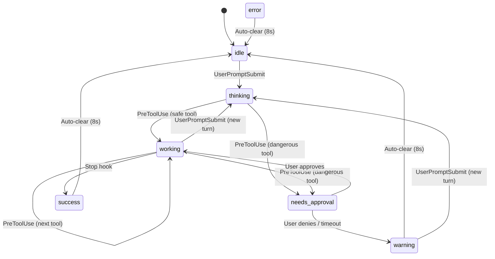

# Sentinel Mascot — System Diagnostic & Refactor Plan

## 1. Reconstructed System Model

### Architecture Overview



### State Ownership

| State | Owner | Mutators |
|-------|-------|----------|
| `sessions{}` | `server.js` (in-memory) | `POST /update`, `POST /action`, auto-clear `setTimeout`, startup purge |
| `approvalResolvers{}` | `server.js` (in-memory) | `GET /wait-approval` (creates), `POST /action` (resolves), timeout (resolves), `res.close` (deletes) |
| Visor color | `index.html` DOM | `updateSlot()` called from `renderSessions()` |
| Window level | `Sentinel.swift` | `checkForApproval()` on 3s timer |
| `state.json` | Disk | `saveState()` (coalesced async write) |

### Control Flow Ambiguities

> [!CAUTION]
> **The PreToolUse hook is SYNCHRONOUS and BLOCKING.** When `sentinel-pre-tool.sh` runs for a dangerous command, Claude Code is fully blocked waiting for the hook's stdout. The hook long-polls `/wait-approval` for up to 31 seconds. This is the #1 source of "blocking Claude's execution."

> [!WARNING]
> **Three independent timers poll server state**, creating a thundering-herd of redundant reads and delayed reactions:
> 1. `index.html` SSE (`EventSource`)
> 2. `index.html` polling (`setInterval` 2s)
> 3. `Sentinel.swift` polling (`Timer` 3s)

---

## 2. State Machine Definition

### States

| State | Meaning | UI (Visor Color) | Mascot Animation |
|-------|---------|-------------------|------------------|
| `idle` | No active work | `#72d6ff` (cyan) | Idle tilt every 4-9s |
| `thinking` | User submitted prompt, model processing | `#7830DC` (purple) | Idle tilt only |
| `working` | Tool executing | `#58C4F0` (blue) | Head bob (700ms) |
| `needs_approval` | Dangerous tool awaiting user decision | `#D71921` (red) | Head bob (400ms) + thought bubble |
| `success` | Work completed | `#2FDFB0` (green) | Idle tilt only |
| `error` | Work failed | `#FF4455` (red) | Idle tilt only |
| `warning` | Approval timed out / denied | `#FFB830` (amber) | Idle tilt only |

### Valid Transitions



### What's Violated in Current Code

> [!IMPORTANT]
> 1. **`thinking` has no distinct animation** — it reuses idle tilt. `handleStateSync()` only activates head-bob for `working` and `needs_approval`. The visor changes to purple but there's no motion cue → user can't visually distinguish "Claude is thinking" from "Claude is idle."
> 2. **`success → working` transition is racey** — The Stop hook is `async: true` but the next PreToolUse is synchronous. The success POST can arrive *after* the next working POST. The server has a guard (lines 122-126) but it only protects `working/thinking → success/error/warning`. It does NOT protect `idle → success` if the auto-clear timer has already fired.
> 3. **No `thinking → success` transition guard** — If Claude thinks but uses no tools, Stop fires `success` directly from `thinking`. This is valid but the auto-clear timer runs, and if a new `UserPromptSubmit` arrives during the 8s window, the timer will overwrite the new `thinking` with `idle`.

---

## 3. Root Cause Analysis

### Bug 1: Visor does not reflect "thinking" state — falls back to idle

**Symptom:** Mascot visor doesn't visually show Claude is thinking; appears idle.

**Root Cause:** `handleStateSync()` ([index.html:261-273](file:///Users/afnan_dfx/projects/gemini-sentinel/index.html#L261-L273)) only starts the head-bob animation for `working` and `needs_approval`. For `thinking`, it cancels all non-idle animations and does nothing — the visor color changes to purple but the animation is identical to idle. Since the visor is tiny (8×6 pixels in the SVG), the color change alone is not perceptible enough.

**Additionally:** The `UserPromptSubmit` hook is `async: true`, meaning Claude doesn't wait for it. If the first `PreToolUse` fires before the `thinking` POST reaches the server, the session jumps `idle → working`, skipping `thinking` entirely. The `thinking` state may never even appear in the UI.

**Fix:** Add a distinct animation for `thinking` (e.g., slower pulse). Also consider making UserPromptSubmit synchronous or adding a sequence number to detect out-of-order updates.

---

### Bug 2: Auto-clear timer stomps on new active state

**Symptom:** Session resets to `idle` while Claude is actively working.

**Root Cause:** The auto-clear timer in [server.js:141-154](file:///Users/afnan_dfx/projects/gemini-sentinel/server.js#L141-L154) captures `status` by value at creation time and checks `sessions[sessionId].status === status` 8 seconds later. **But this check only verifies the status hasn't changed — it doesn't verify no newer work has started.** Consider this sequence:

```
T+0s:  POST /update status=success → timer A starts (clears after 8s if still success)
T+1s:  POST /update status=thinking → session is now thinking
T+3s:  POST /update status=working → session is now working
T+5s:  POST /update status=success → timer B starts; status matches timer A's captured value!
T+8s:  Timer A fires: sessions[claude].status === "success" ✓ → RESETS TO IDLE
       But timer B hasn't fired yet — this is timer A from a stale cycle!
```

The guard at lines 122-126 (`ACTIVE_STATES → TERMINAL_STATES` rejection) prevents some races but NOT this one, because by T+5s the session genuinely is `success` again.

**Fix:** Use a monotonically increasing version counter on each session. The timer captures the version at creation time and only clears if the version still matches.

---

### Bug 3: PreToolUse hook blocks Claude Code execution

**Symptom:** Claude hangs for up to 31 seconds on safe commands.

**Root Cause:** In [claude-hooks.json](file:///Users/afnan_dfx/projects/gemini-sentinel/install/claude-hooks.json#L26-L37), the PreToolUse hook has `"async": true` — but this is **wrong** for an approval hook. Claude Code's PreToolUse hook protocol requires synchronous hooks that return a JSON decision on stdout. If the hook is async, Claude Code doesn't wait for the decision... except when it does (the behavior depends on the Claude Code version and whether the hook returns a blocking decision).

**Actually, wait — re-reading the installed settings.json:** The actual installed hook at `~/.claude/settings.json` does NOT have `"async": true` for PreToolUse. The `claude-hooks.json` template in the repo does have `"async": true` which is wrong and would cause Claude to not wait for the approval decision, but it's not what's installed.

**The real blocking issue:** The installed PreToolUse hook is synchronous (no `async` flag). For dangerous commands, it long-polls `/wait-approval` for up to 31 seconds. **This is correct behavior** — the hook MUST block Claude until the user decides. The blocking is by design.

**However:** For *safe* commands, the hook still runs synchronously. Line 107-110 of `sentinel-pre-tool.sh` fires a background `curl` to update the mascot status AND immediately returns `{"decision":"allow"}`. The `curl &` runs in the background, but the shell script itself is fast. **This is correct and non-blocking for safe commands.**

**Residual issue:** The Python3 subprocess spawn in the hook adds ~100-200ms latency per tool call. For rapid sequences of safe tools, this adds up.

---

### Bug 4: Event updates appear inconsistent or dropped

**Symptom:** UI sometimes doesn't update, or updates arrive out of order.

**Root Cause — multiple contributing factors:**

1. **SSE `express-sse` library broadcasts to ALL connected clients.** When the server calls `sse.send()`, it sends to every SSE connection ever established. If a previous `EventSource` connection is still lingering (WKWebView doesn't always clean up), the message goes to a dead connection AND the live one. This isn't a drop per se, but the library's internal client list can grow unbounded.

2. **`renderSessions()` does full DOM reconciliation on every event.** It replaces `slot.className` on every call (line 251), which triggers CSS re-evaluation. If two SSE events arrive within the same animation frame, the first class change is overwritten before the browser paints it → the user misses the intermediate state.

3. **Polling and SSE race.** Both `EventSource` and `setInterval(2000)` call `renderSessions()`. If a poll response arrives 50ms after an SSE event with newer data, the poll response will have the SAME data (no regression), but if the poll lags, it could render stale data over a newer SSE update. The poll fetches from `/state` which reads the same in-memory object, so this is unlikely but possible if Node's event loop delays the response.

4. **`addLog()` calls `sse.send()` AND `saveState()`.** For a single `/update` request, `addLog()` is called once, which triggers one SSE push. But for `/action`, `addLog()` is called AND then the auto-clear timer later also calls `addLog()` → two SSE pushes. This is correct behavior but can cause rapid-fire updates.

---

### Bug 5: State is stale after server restart

**Symptom:** Mascot shows "working" for a session that no longer exists.

**Root Cause:** The startup purge at [server.js:272-280](file:///Users/afnan_dfx/projects/gemini-sentinel/server.js#L272-L280) only keeps `"main"` and deletes everything else. **But the `"claude"` session is also persistent** (it's in `PERSISTENT_SESSIONS` on line 140). The startup purge deletes `claude`, so on restart the Claude pigeon disappears until the next hook fires.

**Worse:** `state.json` currently has stale sessions (`test3` with `working` status from a previous run). These get purged on restart, but if the server crashes before purge, the UI shows stale data from the file.

**Fix:** The startup purge should reset ALL `PERSISTENT_SESSIONS` to idle (not just `main`), and delete only non-persistent ones.

---

## 4. Hook Audit

### Claude Code Hooks (installed in `~/.claude/settings.json`)

| Hook | Type | Behavior | Verdict |
|------|------|----------|---------|
| `UserPromptSubmit` → thinking | `async: true` | Posts `thinking` to server, returns `{}` immediately | ⚠️ **Race-prone** — async means it may arrive AFTER the first PreToolUse `working` update |
| `PreToolUse` → sentinel-pre-tool.sh | Synchronous | For safe tools: background curl + immediate allow. For dangerous: blocks on long-poll | ✅ **Correct** — blocking is required for approval |
| `Stop` → success | `async: true` | Posts `success` to server | ⚠️ **Race-prone** — can arrive after next cycle's `working` (server guard mostly handles this but see Bug 2) |
| `Notification` → sound | `async: true` | Plays Glass.aiff | ✅ **Correct** — decorative, no state impact |
| `Stop` → sound | `async: true` | Plays Pop.aiff | ✅ **Correct** — decorative, no state impact |

### Gemini CLI Hooks (extension/hooks/hooks.json)

| Hook | Type | Behavior | Verdict |
|------|------|----------|---------|
| `BeforeAgent` → thinking | Synchronous | Posts `thinking` and returns `{}` | ✅ **Correct** |
| `BeforeTool` → sentinel-before-tool.sh | Synchronous | Approval flow + terminal prompt | ⚠️ **Dual-input race** — terminal prompt and mascot long-poll race each other; if terminal wins, it posts `/action` to resolve the long-poll, but if both respond simultaneously the second response hits "no pending approval" |
| `AfterAgent` → success | Synchronous | Posts `success` | ✅ **Correct** |
| `SessionStart` → start server/app | Synchronous (10s timeout) | Starts server, launches app, registers session | ✅ **Correct** |
| `SessionEnd` → end session | Synchronous | Decrements count, may shutdown | ✅ **Correct** |

### sentinel-pre-tool.sh Analysis

- **Correct:** Python subprocess parses JSON, classifies tools, builds display string
- **Correct:** Safe tools return immediately with background status update
- **Correct:** Dangerous tools block on long-poll
- **Harmful:** The SAFE_BASH list includes `rm`, `kill`, `pkill`, `chmod`, `chown` — these are destructive operations that probably shouldn't be auto-approved
- **Redundant:** The safe-command list is duplicated between `sentinel-pre-tool.sh` and `~/.claude/settings.json` permissions. They serve different purposes (hook classification vs Claude's built-in approval) but the duplication is a maintenance burden

### sentinel-before-tool.sh (Gemini) Analysis

- **Harmful pattern:** Dual approval surface (terminal + mascot). If terminal input arrives first, it posts `/action` to resolve the mascot's long-poll, which is correct. But the `read -t 28` races with the 31s `curl` long-poll. If neither responds within 28s, the `read` times out with empty input, falls to the `else` branch, and waits for the curl. This is actually correct but fragile.
- **Missing:** No background status update for safe tools — the `curl` to `/update` is synchronous (no `&`), adding latency to every Gemini tool call.

---

## 5. Event & Sync Layer Analysis

### Current Propagation Path
```
Hook → curl POST /update → server mutates sessions{} → sse.send() → EventSource → renderSessions()
                                                      → saveState() → state.json (async write)
                                          poll /state ← setInterval(2s) ← renderSessions()
                              Swift Timer(3s) → fetch /state → checkForApproval() → window.level
```

### Problems

1. **No event ordering guarantee.** Events are identified only by their content — there's no sequence number, vector clock, or timestamp comparison. Two rapid updates can arrive at the UI in any order.

2. **No deduplication.** SSE and polling both call `renderSessions()` with the same data. This is harmless but wasteful.

3. **Swift layer duplicates server polling.** `checkForApproval()` fetches `/state` every 3 seconds to decide window level. This could be driven by the same SSE stream, or the server could push a notification.

### Proposed Fix: Add a monotonic version counter

```javascript
// server.js
let stateVersion = 0;

function bumpVersion() {
    return ++stateVersion;
}

// In POST /update:
sessions[sessionId] = {
    ...sessions[sessionId],
    status,
    task,
    timestamp: Date.now(),
    version: bumpVersion()  // monotonic per-session
};

// In auto-clear timer:
const capturedVersion = sessions[sessionId].version;
setTimeout(() => {
    if (sessions[sessionId]?.version === capturedVersion) {
        // Safe to clear — no newer update has arrived
    }
}, clearDelay);
```

**For the UI:** `renderSessions()` already replaces the entire slot state on every call, so ordering doesn't matter as long as the *last* render wins. With the 2s poll as backstop, any transient SSE drop self-heals. No change needed in the UI.

**For Swift:** Replace the 3s polling timer with an SSE `EventSource` connection in `WKWebView` that calls a Swift bridge (`window.webkit.messageHandlers`) to update window level. This eliminates the redundant `/state` fetch.

---

## 6. Dependency Audit

### Node Dependencies

| Package | Purpose | Verdict |
|---------|---------|---------|
| `express` (5.2.1) | HTTP server | ✅ Keep — core |
| `cors` | Cross-origin headers | ⚠️ **Questionable** — WKWebView loads from `http://localhost:49152` so same-origin. Only needed if external tools hit the API, but `express.static` serves the HTML from the same origin. Could remove. |
| `body-parser` (2.2.2) | JSON parsing | ⚠️ **Redundant** — Express 5 includes `express.json()` natively. `body-parser` is a legacy dependency. |
| `express-sse` (1.0.0) | SSE broadcasting | ⚠️ **Problematic** — This library has no client tracking, no reconnection support, and its `init()` method has quirks. The entire SSE implementation is ~15 lines of code; replace with a manual implementation for better control. |
| `morgan` (1.10.1) | Request logging | ✅ Keep — useful for debugging |

### Recommendations

1. **Remove `body-parser`** — replace `bodyParser.json()` with `express.json()`
2. **Remove `cors`** — same-origin requests don't need it; if needed, add a simple middleware (3 lines)
3. **Remove `express-sse`** — replace with manual SSE (eliminates ghost client accumulation bug)
4. **Keep `morgan`** — essential for diagnosing hook timing issues

---

## 7. Refactor Plan (Prioritized, Execution-Ready)

### Step 1: Fix the auto-clear timer race (Bug 2) — CRITICAL

**Problem:** Timer captures `status` but not a version, so it can clear a legitimately new `success` state from a different work cycle.

**Implementation:**

In `server.js`, add a per-session version counter:

```javascript
// At top of file
let globalVersion = 0;

// In POST /update handler, when setting session:
sessions[sessionId] = {
    ...sessions[sessionId],
    ...(name && { name }),
    status,
    task,
    timestamp: Date.now(),
    _v: ++globalVersion
};

// In the auto-clear setTimeout:
if (['success', 'error', 'warning'].includes(status)) {
    const capturedVersion = sessions[sessionId]._v;
    const clearDelay = PERSISTENT_SESSIONS.has(sessionId) ? 8000 : 4000;
    setTimeout(() => {
        if (sessions[sessionId]?._v === capturedVersion) {
            // Version matches — no newer update arrived, safe to clear
            if (PERSISTENT_SESSIONS.has(sessionId)) {
                sessions[sessionId] = { id: sessionId, name: sessions[sessionId]?.name || sessionId, status: 'idle', task: 'Ready', timestamp: Date.now(), _v: ++globalVersion };
                addLog(sessionId, 'idle', 'Ready');
            } else {
                delete sessions[sessionId];
                saveState();
            }
        }
    }, clearDelay);
}
```

**Why this works:** Each `POST /update` bumps the version. The timer only fires if no subsequent update has touched the session. This eliminates the false-clear in the `success → thinking → working → success → timer-A-fires` scenario.

---

### Step 2: Fix startup purge to include `claude` session — HIGH

**Problem:** Startup purge only keeps `main`, deleting the `claude` persistent session.

**Implementation:** In startup purge block (lines 272-280):

```javascript
const PERSISTENT_SESSIONS_SET = new Set(['main', 'claude']);
Object.keys(sessions).forEach(id => {
    if (PERSISTENT_SESSIONS_SET.has(id)) {
        sessions[id].status = 'idle';
        sessions[id].task = 'Ready';
    } else {
        delete sessions[id];
    }
});
```

---

### Step 3: Add `thinking` animation to UI — HIGH

**Problem:** `thinking` state is visually indistinguishable from `idle`.

**Implementation:** In `handleStateSync()` in `index.html`:

```javascript
function handleStateSync(slot, status) {
    const head = slot.querySelector('.p-head-unit');
    head.getAnimations().forEach(a => { if (a.id !== 'idle') a.cancel() });
    
    if (status === 'thinking') {
        // Gentle pulse — distinct from working bob
        const think = head.animate([
            { transform: 'rotate(0) scale(1)' },
            { transform: 'rotate(-2deg) scale(1.02)', offset: 0.5 },
            { transform: 'rotate(0) scale(1)' }
        ], { duration: 1200, iterations: Infinity, easing: 'ease-in-out' });
        think.id = 'active-anim';
    } else if (status === 'working' || status === 'needs_approval') {
        const speed = status === 'needs_approval' ? 400 : 700;
        const bob = head.animate([
            { transform: 'translateY(0) rotate(0deg)' },
            { transform: `translateY(${status === 'needs_approval' ? '5px' : '3px'}) rotate(2deg)`, offset: 0.5 },
            { transform: 'translateY(0) rotate(0deg)' }
        ], { duration: speed, iterations: Infinity, easing: 'ease-in-out' });
        bob.id = 'active-anim';
    }
}
```

---

### Step 4: Replace `express-sse` with manual SSE — MEDIUM

**Problem:** `express-sse` accumulates dead client references and has no cleanup.

**Implementation:**

```javascript
// Replace the SSE import and setup with:
const sseClients = new Set();

function sseBroadcast(data, event = 'update') {
    const payload = `event: ${event}\ndata: ${JSON.stringify(data)}\n\n`;
    for (const res of sseClients) {
        if (!res.writableEnded) {
            res.write(payload);
        } else {
            sseClients.delete(res);
        }
    }
}

app.get('/stream', (req, res) => {
    res.writeHead(200, {
        'Content-Type': 'text/event-stream',
        'Cache-Control': 'no-cache',
        'Connection': 'keep-alive',
    });
    res.write('\n'); // flush headers
    
    sseClients.add(res);
    
    // Send current state immediately
    setTimeout(() => sseBroadcast({ sessions, history }), 50);
    
    // Heartbeat
    const heartbeat = setInterval(() => {
        if (!res.writableEnded) {
            res.write(':heartbeat\n\n');
        }
    }, SSE_HEARTBEAT_MS);
    
    req.on('close', () => {
        clearInterval(heartbeat);
        sseClients.delete(res);
    });
});

// Replace all sse.send() calls with sseBroadcast()
```

---

### Step 5: Remove redundant dependencies — MEDIUM

**Implementation:**

```diff
// server.js
-const bodyParser = require('body-parser');
 // ...
-app.use(bodyParser.json());
+app.use(express.json());
```

Remove `cors` import and `app.use(cors())` — same-origin requests don't need it.

```bash
npm uninstall body-parser cors express-sse
```

Update `package.json` to remove the three packages.

---

### Step 6: Eliminate Swift polling — LOW

**Problem:** `checkForApproval()` polls `/state` every 3 seconds independently of the SSE stream.

**Implementation:** Instead of Swift polling, inject a JavaScript bridge in the WKWebView:

```swift
// In setupWindow(), add a message handler:
let userController = webView.configuration.userContentController
userController.add(self, name: "sentinel")

// Implement WKScriptMessageHandler:
extension AppDelegate: WKScriptMessageHandler {
    func userContentController(_ controller: WKUserContentController, didReceive message: WKScriptMessage) {
        guard let body = message.body as? [String: Any],
              let needsApproval = body["needsApproval"] as? Bool else { return }
        DispatchQueue.main.async {
            if needsApproval {
                self.window.level = .screenSaver
                self.window.orderFrontRegardless()
            } else {
                self.window.level = .floating
            }
        }
    }
}
```

In `index.html`, add to `renderSessions()`:

```javascript
// After rendering, notify Swift layer
const anyApproval = Object.values(sessions).some(s => s.status === 'needs_approval');
if (window.webkit?.messageHandlers?.sentinel) {
    window.webkit.messageHandlers.sentinel.postMessage({ needsApproval: anyApproval });
}
```

Remove `checkForApproval()` and the 3s timer for it from Swift.

---

### Step 7: Reduce hook latency for safe commands — LOW

**Problem:** Every PreToolUse invocation spawns Python3 (~150ms) even for safe tools.

**Implementation:** Rewrite `sentinel-pre-tool.sh` classification in pure bash:

```bash
#!/usr/bin/env bash
INPUT=$(cat)
# Extract tool_name with lightweight jq-like parsing
TOOL_NAME=$(printf '%s' "$INPUT" | python3 -c "import sys,json; print(json.load(sys.stdin).get('tool_name',''))" 2>/dev/null)

# Fast-path: non-approval tools
case "$TOOL_NAME" in
    Bash|Write|Edit|NotebookEdit) ;; # continue to classification
    *)
        # Auto-allow, fire-and-forget status update
        curl -s --max-time 2 -X POST http://localhost:49152/update \
            -H 'Content-Type: application/json' \
            -d "{\"id\":\"claude\",\"name\":\"Claude\",\"status\":\"working\",\"task\":\"$TOOL_NAME\"}" \
            > /dev/null 2>&1 &
        echo '{"decision":"allow"}'
        exit 0
        ;;
esac
# ... rest of classification for Bash/Write/Edit
```

This avoids the full Python parse for ~60% of tool calls (Read, Search, WebFetch, etc).

---

## Open Questions

> [!IMPORTANT]
> 1. **Should `rm`, `kill`, `pkill`, `chmod` remain in the SAFE_BASH list?** These are currently auto-approved by the hook. They are also in `~/.claude/settings.json` permissions allow list. If Claude is trusted to run these without approval, the hook classification is correct. If not, they should be removed from SAFE_BASH and the mascot will prompt for approval.

> [!IMPORTANT]
> 2. **Should the PreToolUse hook for Claude remain synchronous?** Currently it must be synchronous because it's the approval gatekeeper. The settings.json has `Bash(**)` which auto-allows everything at Claude's level — the hook is the ONLY thing that can block dangerous commands. If you want Claude's own approval dialog instead, remove `Bash(**)` from settings.json and make the hook async. But then the mascot can't be the approval surface.

> [!IMPORTANT]
> 3. **What about the `thinking` not being async?** The `UserPromptSubmit` hook is async, so Claude doesn't wait for it. This means the `thinking` state update races with the first `PreToolUse`. Should we accept that `thinking` may be skipped in the UI (since it's cosmetic), or do you want a guaranteed `thinking` frame before any `working` state?

---

## Verification Plan

### Automated Tests

Run `test_idle_bug.sh` after Step 1 to verify the auto-clear timer race is fixed:
```bash
./test_idle_bug.sh
```

Simulate rapid state transitions to verify version counter:
```bash
# Rapid cycle: success → thinking → working → success
for i in {1..10}; do
  curl -s -X POST http://localhost:49152/update -H 'Content-Type: application/json' \
    -d '{"id":"claude","name":"Claude","status":"success","task":"Done"}' &
  sleep 0.1
  curl -s -X POST http://localhost:49152/update -H 'Content-Type: application/json' \
    -d '{"id":"claude","name":"Claude","status":"thinking","task":"Thinking..."}' &
  sleep 0.1
  curl -s -X POST http://localhost:49152/update -H 'Content-Type: application/json' \
    -d '{"id":"claude","name":"Claude","status":"working","task":"Working"}' &
  sleep 0.5
done
# Check: should be working, not idle
curl -s http://localhost:49152/state | python3 -c "import sys,json; print(json.load(sys.stdin)['sessions']['claude']['status'])"
```

### Manual Verification

1. After Step 3: Visually confirm pigeon shows a distinct animation when Claude is thinking vs idle
2. After Step 4: Monitor `server.log` — should see no SSE client accumulation warnings
3. After Step 6: Verify mascot still rises to screenSaver level on `needs_approval` without the Swift timer
